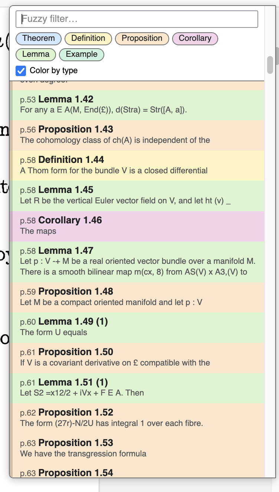

# Theorem List (Zotero 7 plugin)

Adds a `∴` button to the PDF reader's top toolbar. Click it to get a popup
listing every line that starts a theorem-like environment
(Theorem / Lemma / Proposition / Corollary / Definition / Remark / Claim /
Conjecture / Example / Assumption). Click an entry — or select with ↑/↓ and
press Enter — to jump to it in the PDF.

It scans the PDF's own text layer — no content extraction, no network, just a
regex over the lines pdf.js already gives the reader.



The popup also has a fuzzy filter, per-type filter chips, and an optional
pastel "Color by type" mode.

## Install (dev)

```sh
# Build the installable .xpi (just a zip of these files):
cd zotero-theorem-list
zip -r theorem-list.xpi manifest.json bootstrap.js
```

Then in Zotero: **Tools → Plugins → gear icon → Install Plugin From File…**
and pick `theorem-list.xpi`. Open any PDF and look for `∴` in the reader toolbar.

For live development, point Zotero at the folder instead of zipping: create a
file named `theorem-list@local` (the id from `manifest.json`) inside your Zotero
profile's `extensions/` directory whose contents are the absolute path to this
folder, then restart Zotero.

## Tweak it

- Edit `KEYWORDS` in `bootstrap.js` to change which environments are listed.
- `node test.js` runs the self-check for the line-grouping + matching logic.

## Caveats

- Detection is heuristic and font-aware: a **bold** keyword counts as a header
  even without a number (catches `Theorem.`, `Theorem A.1`, `Theorem IV`); a
  non-bold keyword must be followed by a number/letter *and* a header-shaped
  continuation, which drops in-text cross-references (`…by Theorem 3.1 we…`) and
  table-of-contents entries. Tune `KEYWORDS` / `classify` in `bootstrap.js`.
- Uses the reader's internal `_internalReader._primaryView` to reach pdf.js,
  which is not a documented API — may need a touch-up across major Zotero updates.
- PDF-only (no EPUB/snapshot).
