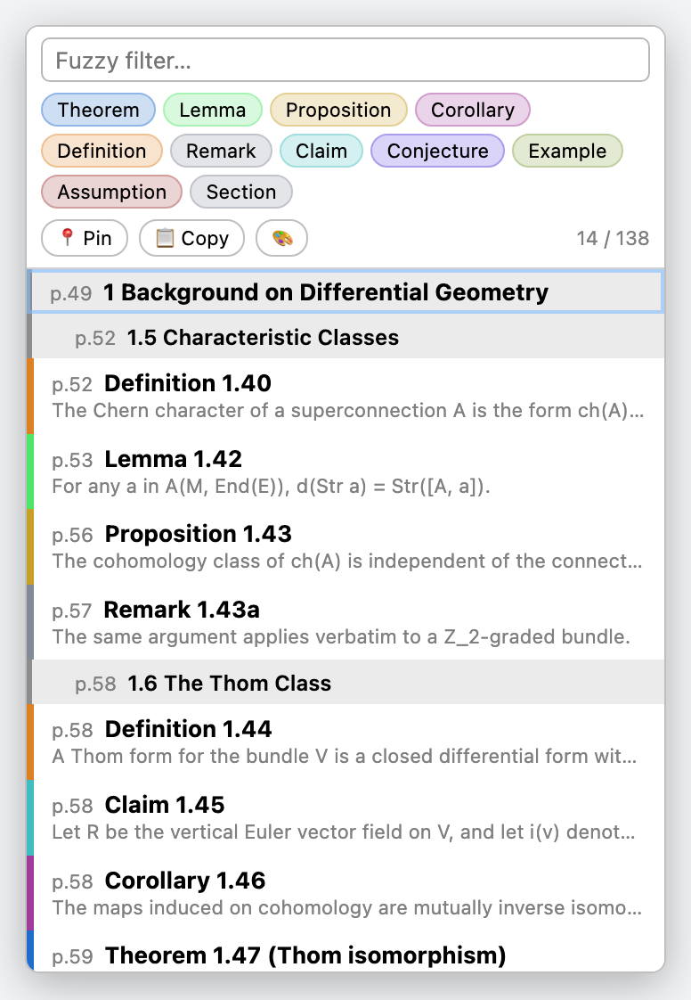
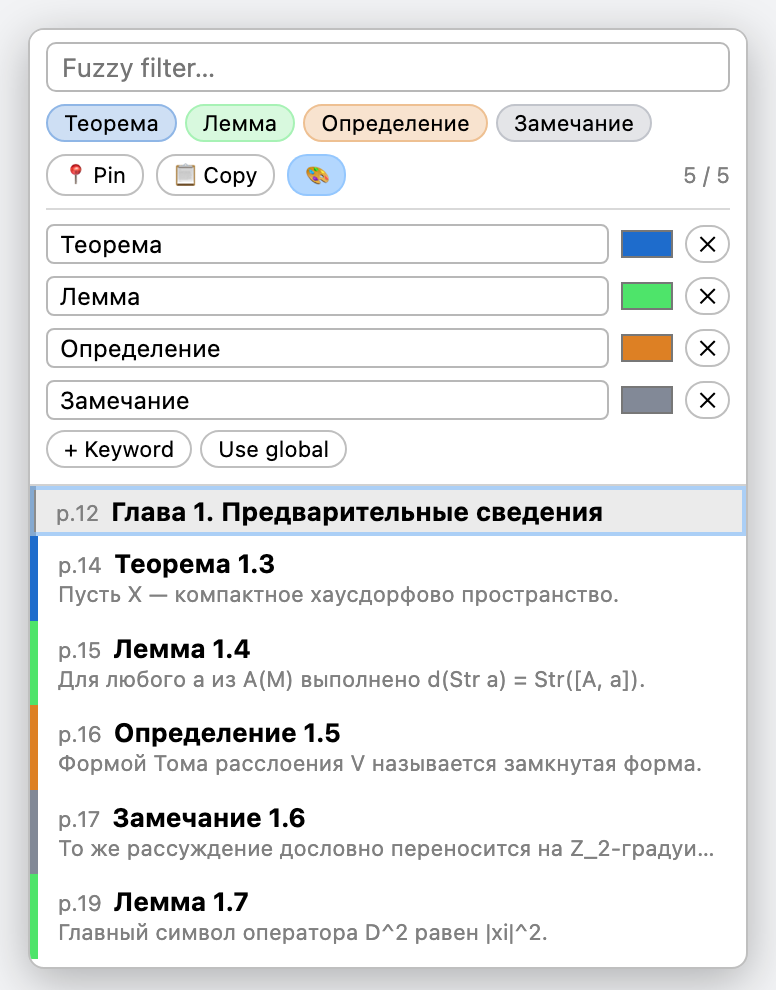

# Theorem List (Zotero plugin)

Adds a `∴` button to the PDF reader's top toolbar. Click it to get a popup
listing every line that starts a theorem-like environment
(Theorem / Lemma / Proposition / Corollary / Definition / Remark / Claim /
Conjecture / Example / Assumption). Click an entry — or select with ↑/↓ and
press Enter — to jump to it in the PDF.

It scans the PDF's own text layer — no content extraction, no network, just a
regex over the lines pdf.js already gives the reader.



<sub>Rendered from the plugin's own stylesheet — same markup and CSS as the
panel in the reader, minus the PDF behind it.</sub>

The popup also has a fuzzy filter and per-type filter chips; each entry carries
a colored stripe for its environment type, and outline sections stick to the top
of the list as you scroll.

## Install (dev)

```sh
# Build the installable .xpi (just a zip of these files):
cd zotero-theorem-list
zip -r theorem-list.xpi manifest.json bootstrap.js icon.svg prefs.xhtml prefs.js prefs.css
```

Then in Zotero: **Tools → Plugins → gear icon → Install Plugin From File…**
and pick `theorem-list.xpi`. Open any PDF and look for `∴` in the reader toolbar.

For live development, point Zotero at the folder instead of zipping: create a
file named `theorem-list@local` (the id from `manifest.json`) inside your Zotero
profile's `extensions/` directory whose contents are the absolute path to this
folder, then restart Zotero.

## Settings

**Zotero → Settings → Theorem List** lists the environments the plugin looks
for, each with its stripe color:

- **Add keyword** appends a row. Keywords are matched case-insensitively and can
  be in any language — `Лемма`, `Utsagn` and `Satz` work the same as `Theorem`.
  Multi-word (`Основная теорема`) and punctuated (`Thm.`) entries work too, and
  the longest matching keyword wins, so a specific entry isn't shadowed by a
  general one. New rows get a color that stays distinct from those already used.
- The last row can't be removed — an empty list would fall back to the built-in
  defaults, which looks like the delete did nothing.
- Click a swatch to recolor any environment, built-in ones included.
- **✕** removes a row; **Reset to defaults** restores the built-in list.

Changes apply immediately — open panels close and cached scans are dropped, so
the next open re-scans with the new keywords.

### Just this book

The small **🎨** button in the popup opens the same editor for the current
document only — useful when one book uses `Утверждение` or `Satz` and the rest
of your library doesn't. It stays collapsed until you click it, and closes again
when you reopen the popup. Edits take effect right away; **Use global** drops the
override and goes back to the Settings list.



This list is held in memory, not saved: it is gone when Zotero restarts, and
that is deliberate. Settings is the place for anything you want to keep.

The defaults are ten environments whose colors are solved for maximum
perceptual separation (minimum CIEDE2000 distance ≈ 17.7), so no two stripes
read as the same color at 4px wide.

## Tweak it

- `DEFAULT_TYPES` in `bootstrap.js` seeds the settings list; `SPARE_COLORS` is
  the sequence handed to newly added keywords.
- `node test.js` runs the self-check for the line-grouping + matching logic.

## Caveats

- Detection is heuristic and font-aware: a **bold** keyword counts as a header
  even without a number (catches `Theorem.`, `Theorem A.1`, `Theorem IV`); a
  non-bold keyword must be followed by a number/letter *and* a header-shaped
  continuation, which drops in-text cross-references (`…by Theorem 3.1 we…`) and
  table-of-contents entries. Tune the keyword list in Settings, or `classify`
  in `bootstrap.js`.
- Uses the reader's internal `_internalReader._primaryView` to reach pdf.js,
  which is not a documented API — may need a touch-up across major Zotero updates.
- PDF-only (no EPUB/snapshot).
